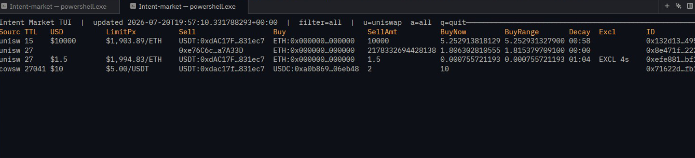

# Intent Market

Real-time monitoring pipeline for off-chain signed orders ("intents") from Cow Swap and UniswapX.

Built for low latency: a Go ingestor polls venue APIs, a Rust engine maintains an in-memory active orderbook with TTL expiry, and a Ratatui dashboard visualizes live state — all connected over ZeroMQ with minimal overhead.
<br>


<br>

## Architecture

Three modular services communicating over ZeroMQ:

| Service | Language | Role |
|---------|----------|------|
| **ingestor** | Go | Polls UniswapX + CoW Swap APIs and publishes intent messages |
| **engine** | Rust | Subscribes to ingestor, deduplicates, tracks TTL, republishes state |
| **tui** | Rust | Subscribes to engine state and renders a Ratatui dashboard |

**Transport:** ZeroMQ over TCP (works in Docker and on Mac). IPC (`ipc://`) can be added later for same-host runs.

**Data model philosophy:** Broadcast/store "everything" from venues and attempt a best-effort normalized view (id, tokens, amounts, deadline) for the TUI. Unknown/missing fields are allowed.

## Monorepo layout

```
shared/             — intent envelope schema + examples
ingestor/           — Go service (providers + publisher + JSONL logging)
engine/             — Rust workspace
├── engine/         —   ZMQ subscriber + orderbook + state publisher
└── tui/            —   Ratatui UI (subscribes to engine state)
tools/              — Python log inspection scripts
docker/             — Dockerfiles
docker-compose.yml  — bring up ingestor + engine (+ optional tui)
```

## Quickstart

### Docker (recommended)

Start the ingestor and engine:

```sh
docker compose up --build
```

In a **separate terminal**, launch the TUI with an interactive terminal:

```sh
docker compose run --rm tui
```

> `docker compose run` attaches a real TTY so the Ratatui dashboard renders properly. Press **`q`** to quit the TUI (backends keep running). Alternatively, run everything together with `docker compose --profile tui up --build`, but the TUI output will be mixed into the compose log stream.

### Native (Mac)

Run each service in its own terminal:

```sh
# Terminal 1 — ingestor
cd ingestor && go run ./cmd/ingestor

# Terminal 2 — engine
cd engine && cargo run -p engine

# Terminal 3 — TUI
cd engine && cargo run -p tui
```

### Dependencies

- **Go** — for the ingestor
- **Rust** — for the engine and TUI
- **ZeroMQ** (`libzmq`) — for inter-process messaging
  - macOS: `brew install zmq`
  - Docker: included in the Dockerfiles

## APIs

- **UniswapX:** `GET https://api.uniswap.org/v2/orders?orderStatus=open`
- **CoW Swap:** `GET https://barn.api.cow.fi/mainnet/api/v1/auction` (flatten orders; Barn is test/latest-features)
  - Barn Mainnet: https://barn.api.cow.fi/mainnet/api (real money, new features)
  - Barn Sepolia: https://barn.api.cow.fi/sepolia/api (fake money, testing)

## Logging & analysis

The ingestor logs every raw venue response (enriched with source, network, and timestamp) to JSONL files. Each line is one envelope containing the source identifier, the normalized intent fields, and the full raw payload.

### Output location

- **Docker:** logs are written to `./out/ingestor/` (mounted from the container).
- **Native:** logs are written to `./out/ingestor/` relative to the ingestor binary.

The ingestor creates a new file per run with a timestamped filename.

### Analyzing logs with the Python script

The `tools/inspect_intents.py` script reads these JSONL files and provides flexible filtering and display. If `--file` is omitted it automatically picks the newest file in `./out/ingestor/`.

```sh
# Overall stats (total count + breakdown by source)
python tools/inspect_intents.py --stats

# Last 10 CoW Swap orders (summary view, default)
python tools/inspect_intents.py --source cowswap --head 10

# Last 5 UniswapX orders with human-readable amounts
python tools/inspect_intents.py --source uniswapx --head 5 --human

# Find a specific order by ID and show the raw API response
python tools/inspect_intents.py --contains-id 0xabc --show raw --pretty

# Show the full envelope (metadata + normalized + raw)
python tools/inspect_intents.py --head 1 --show envelope --pretty

# Show just normalized fields for inspection
python tools/inspect_intents.py --source cowswap --head 3 --show normalized --pretty
```

### Script reference

| Flag | Default | Description |
|------|---------|-------------|
| `--file` | newest in `./out/ingestor/` | Path to a specific JSONL file |
| `--source` | all | Filter by source (`cowswap`, `uniswapx`) |
| `--contains-id` | none | Filter by substring match on the intent ID |
| `--head` | 20 | Max rows to print |
| `--stats` | off | Print only total count and per-source breakdown |
| `--show` | `summary` | What to display: `summary`, `normalized`, `raw`, `envelope` |
| `--pretty` | off | Pretty-print JSON for `raw`, `normalized`, or `envelope` views |
| `--human` | off | In summary view, render amounts using known token decimals |

## Progress checklist

Legend: `[ ]` not started, `[~]` in progress, `[x]` done


## Notes

- TCP is the default ZeroMQ transport (works in Docker and on Mac).
- Message schema is in `shared/intent.schema.json` and will evolve as we learn real payloads.
- Development machine is Windows, but we do not run ZeroMQ native on Windows — Docker is used instead.
